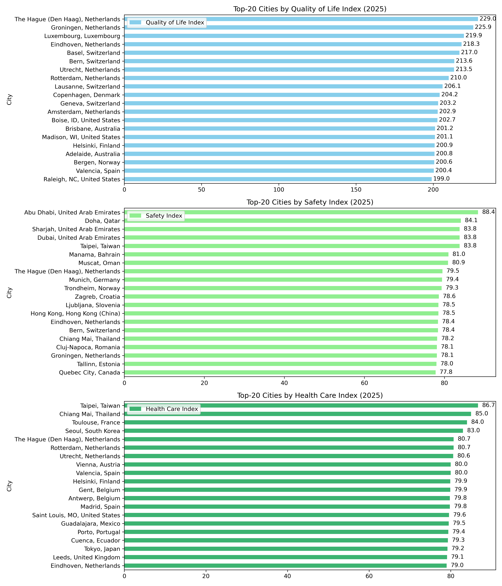

# 🌍 quality-of-life-2025

**Data analysis and visualization of Top‑20 cities by Quality of Life, Safety, and Health Care indexes (2025).**

---

## 📂 Project Structure
```
quality-of-life-2025/
├── data/
│ └── quality_of_life_2025.html      # Original HTML exported from Numbeo
├── quality_of_life_2025.ipynb       # Jupyter Notebook with full analysis
├── quality_of_life_2025.csv         # Cleaned dataset in CSV format
├── images/
│ ├── top_20_indexes_2025.png        # Final charts in PNG format
│ └── top_20_indexes_2025.svg        # Final charts in SVG format
└── README.md                        # Project documentation and overview
```
---

## 📖 Introduction

In this mini-project, I analyzed the quality of life in the world’s major cities for the year 2025.

I selected the Top-20 cities to ensure broader geographic diversity and avoid repetition caused by one country dominating the top rankings.

The source was the Numbeo website, but as the required table could not be extracted directly using `requests`, I manually saved the HTML page and used it as the source for parsing.

With `BeautifulSoup`, I extracted the table containing the full set of quality-of-life metrics (e.g., quality of life, safety, health care, cost of living, climate).

From all available metrics, I selected **three key indexes** for detailed visualization:
- Quality of Life Index  
- Safety Index  
- Health Care Index  

These are the most publicly relevant indicators — they reflect the balance between comfort, security, and access to medical services.

---

## 🎯 Project Goal

***Project Goal*** — to extract data on the quality of life in cities around the world for the year **2025** from an HTML document using web scraping, convert it into a convenient format with **pandas**, and visualize the **Top 20 cities** based on the following key indexes:

- Quality of Life Index  
- Safety Index  
- Health Care Index

This project serves as practical training in **web scraping**, **data processing**, and **data visualization using Python**.

---

### 🛠️ Technologies Used
- Python (Pandas, Matplotlib)
- Jupyter Notebook
- Git & GitHub

---

## 🧰 Libraries Used

- `BeautifulSoup` — HTML parsing and element extraction  
- `pandas` — data processing and analysis  
- `matplotlib` — visualization of Top-20 cities  

---

## 🔗 Data Source

The dataset was taken from:  
🌐 [https://www.numbeo.com/quality-of-life/rankings.jsp?title=2025](https://www.numbeo.com/quality-of-life/rankings.jsp?title=2025)

The table was saved manually and parsed from the local HTML file using BeautifulSoup.

---

## 📊 Visualizations

The project visualizes three horizontal bar charts 
:
- Top-20 cities by **Quality of Life**
- Top-20 cities by **Safety**
- Top-20 cities by **Health Care**

Final charts were saved in both `.png` and `.svg` formats.


---


## 💾 Outputs

- [`quality_of_life_2025.csv`](./quality_of_life_2025.csv) — cleaned dataset
- [`top_20_indexes_2025.png`](./images/top_20_indexes_2025.png) — chart image for presentation
- [`top_20_indexes_2025.svg`](./images/top_20_indexes_2025.svg) — scalable chart for web or print

---

## ✅ Summary

- Parsed an HTML table using BeautifulSoup  
- Converted data into pandas DataFrame  
- Built three visualizations using matplotlib  
- Saved final results in CSV, PNG, and SVG formats

---

## 📌 Insights

- **The Netherlands** stands out as a consistent top performer across all indexes  
- **Middle Eastern cities** rank high in safety but not in quality of life  
- **Taiwan and South Korea** lead in health care  
- Quality of life is a multi-factor concept — high safety doesn’t always mean high comfort

---

## 👩‍💻 Author

**Palina Krasiuk**  
Aspiring Cloud Data Engineer | ex-Senior Accountant  
[LinkedIn](https://www.linkedin.com/in/palina-krasiuk-954404372/) • [GitHub Portfolio](https://github.com/CloudDataPalina)
